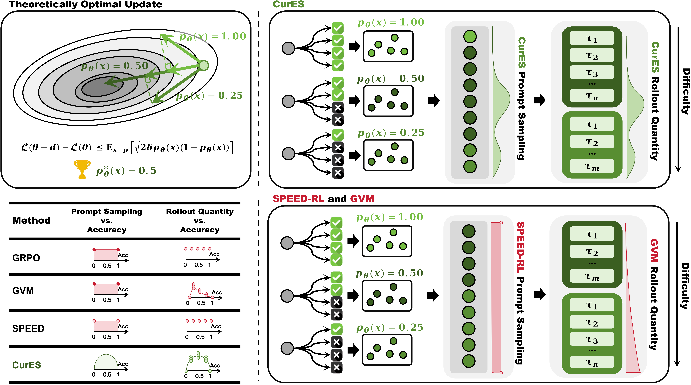

<div align="center">

# CurES - From Gradient Analysis to Efficient Curriculum Learning for Reasoning LLMs
[](https://arxiv.org/html/2510.01037v1) [](https://github.com/ZexuSun/CurES)
</div>

## 👋 Introduction

This repo is the official implementation of [*CurES - From Gradient Analysis to Efficient Curriculum Learning for Reasoning LLMs*](https://arxiv.org/html/2510.01037v1)

In this work, we approach the problem from the perspective of reinforcement learning gradient optimization, offering a systematic and theoretical investigation into how to improve the training efficiency of LLMs. We identify two key factors influencing training efficiency: 
- the selection of training prompts
- the allocation of rollout quantities across different prompts. 

Based on these insights, we propose CurES, an efficient training method that accelerates convergence and employs Bayesian posterior estimation to minimize computational overhead. 

<p align="center">
  
</p>

## 👷 Environment Setup
1. Create a new environment.
   ```bash
   conda create -n cures python==3.10
   conda activate cures
   ```

2. Install dependencies
   ```bash
   pip install pip --upgrade
   pip install uv
   git clone https://github.com/ZexuSun/CurES.git
   cd CurES/
   python -m uv pip install -r requirements.txt
   ```

## 🚀 Launch the Training

1. Start the training loop.
   ```bash
   # Initialize Ray
   ray start --head --dashboard-host=0.0.0.0
   ray stop --force
   # Login wandb
   wandb login
   # Use GRPO as advantage estimator.
   # Modify run_cures_grpo.sh (e.g., wandb api key, model root, ckpts root, etc.) before running.
   bash runs/scripts/run_cures_grpo.sh
   # Use Reinforce++ as advantage estimator
   # Modify run_cures_rpp.sh (e.g., wandb api key, model root, ckpts root, etc.) before running.
   bash runs/scripts/run_cures_rpp.sh
   ```

## 🫡 Citation
If you find this repository helpful, a citation to our paper would be greatly appreciated:
```
@misc{zeng2025curesgradientanalysisefficient,
      title={CurES: From Gradient Analysis to Efficient Curriculum Learning for Reasoning LLMs}, 
      author={Yongcheng Zeng and Zexu Sun and Bokai Ji and Erxue Min and Hengyi Cai and Shuaiqiang Wang and Dawei Yin and Haifeng Zhang and Xu Chen and Jun Wang},
      year={2025},
      eprint={2510.01037},
      archivePrefix={arXiv},
      primaryClass={cs.LG},
      url={https://arxiv.org/abs/2510.01037}, 
}
```

## Acknowledgement
We greatly thanks [VERL](https://github.com/volcengine/verl) for providing the awesome codebase.

We also appreciate the rollout quantity code framework design of [GVM](https://github.com/RLHFlow/GVM).